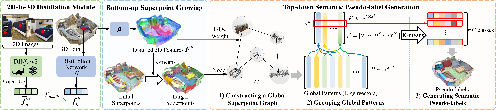
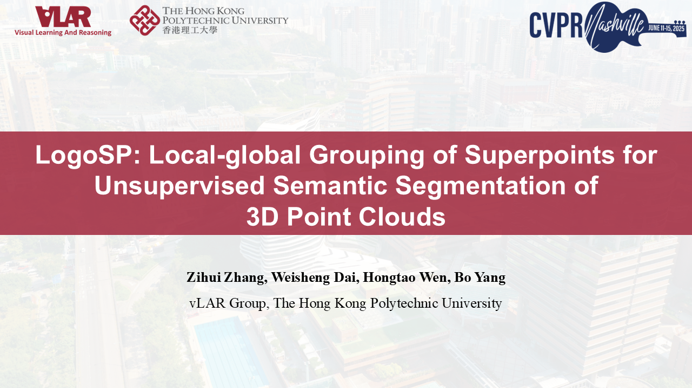

[](https://arxiv.org/abs/2506.07857)

[](https://creativecommons.org/licenses/by-nc-sa/4.0/legalcode)
[](https://twitter.com/vLAR_Group)

## LogoSP: Local-global Grouping of Superpoints for Unsupervised Semantic Segmentation of 3D Point Clouds (CVPR 2025)
[Zihui Zhang](https://scholar.google.com.hk/citations?hl=en&user=jiwazT8AAAAJ&view_op=list_works&sortby=pubdate), Weisheng Dai, [Hongtao Wen](https://hatimwen.github.io/), [Bo Yang](https://yang7879.github.io/)

### Overview

We propose an unsupervised learning approach for 3D semantic segmentation.

<p align="center">  </p>

The global patterns are semantic-aware, and our performances exceed baselines:
|    |    |
| ----------------------   |   ------------------ |

### [Full demo (Youtube)](https://youtu.be//auPun0dd7sM)
<p align="center"> <a href="https://youtu.be/auPun0dd7sM"></a> </p>


## 1. Environment

```shell script
### CUDA 11.8  GCC 9.4
conda env create -f env.yml
source activate LogoSP

conda install pytorch==2.3.0 torchvision==0.18.0 torchaudio==2.3.0 pytorch-cuda=11.8 -c pytorch -c nvidia
conda install pytorch-scatter -c pyg

git clone https://github.com/NVIDIA/MinkowskiEngine.git
```
Modify the MinkowskiEngine to adapt to Pytorch 2.x 
1. MinkowskiEngine/src/3rdparty/concurrent_unordered_map.cuh: Add '#include <thrust/execution_policy.h>'
2. MinkowskiEngine/src/convolution_kernel.cuh: Add '#include <thrust/execution_policy.h>'
3. MinkowskiEngine/src/coordinate_map_gpu.cu: Add '#include <thrust/unique.h>' and '#include <thrust/remove.h>'
4. MinkowskiEngine/src/spmm.cu: Add '#include <thrust/execution_policy.h>', '#include <thrust/reduce.h>', and '#include <thrust/sort.h>'
```shell script
cd MinkowskiEngine
python setup.py install --blas=openblas
```

## 2. Data Preparation
The data preparation process includes segmentation data, superpoints, and DINOv2 feature extraction and projection.
### ScanNet
We mainly follow [GrowSP](https://github.com/vLAR-group/GrowSP) to preprocess the ScanNet dataset and build superpoints.

For ScanNet data, please download from [here](http://kaldir.vc.in.tum.de/scannet_benchmark/documentation). 
Uncompress the folder and move it to  `./data/ScanNet/raw/`.

For superpoints, we can follow [GrowSP](https://github.com/vLAR-group/GrowSP) to use VCCS+Region Growing or use the ScanNet officially provided Felzenszwalb superpoints (optional). 
Choosing one of them with data preprocessing is enough.

#### (1). GrowSP superpoints with data preprocessing:
```shell script
python data_prepare/data_prepare_ScanNet.py --data_path './data/ScanNet/raw' --processed_data_path './data/ScanNet/processed' --Felzenszwalb False
python data_prepare/initialSP_prepare_ScanNet.py --input_path './data/ScanNet/processed/' --sp_path './data/ScanNet/initial_superpoints/'
```

#### (2). Felzenszwalb superpoints and data preprocessing (optional, better segmentation performance):
Please download the [ScanNet toolkit](https://github.com/ScanNet/ScanNet) and come into `ScanNet/Segmentor` to build by running `make` (or create makefiles for your system using `cmake`). 
This will create a segmentator binary file. 
Then, go outside the `./ScanNet` to run the segmentator:
```shell script
./run_segmentator.sh your_scannet_tranval_path ## e.g ./data/ScanNet/raw/scans
./run_segmentator.sh your_scannet_test_path ## e.g ./data/ScanNet/raw/scans_test
# Running the preprocessing when having the superpoint files.
python data_prepare/data_prepare_ScanNet.py --data_path './data/ScanNet/raw' --processed_data_path './data/ScanNet/processed' --processed_sp_path './data/ScanNet/Felzenszwalb'
```


After superpoints construction and data preprocessing by (1) or (2), we can extract and project DINOv2 features.
We resume the data provided by [OpenScene](https://github.com/pengsongyou/openscene), uncompress them and put into `./data/ScanNet`
```shell script
wget https://cvg-data.inf.ethz.ch/openscene/data/scannet_processed/scannet_3d.zip
wget https://cvg-data.inf.ethz.ch/openscene/data/scannet_processed/scannet_2d.zip
```
Finally, extracting DINOv2 features and project to 3D point clouds by:
```shell script
python project_ScanNet.py
```
This will create 3D point clouds with features in `./data/ScanNet/DINOv2_feats_s14up4_voxel_0.05`.
The data structure should be:
```shell script
ScanNet
└── processed
└── scannet_3d
|   └── train
|   └── val
|   └── scannetv2_train.txt
|   └── scannetv2_val.txt
|   └── scannetv2_test.txt
└── initial_superpoints_0.25
└── Felzenszwalb (optional)
└── DINOv2_feats_s14up4_voxel_0.15
```

### S3DIS
S3DIS dataset can be found [here](https://docs.google.com/forms/d/e/1FAIpQLScDimvNMCGhy_rmBA2gHfDu3naktRm6A8BPwAWWDv-Uhm6Shw/viewform?c=0&w=1). 
Download the files named "Stanford3dDataset_v1.2_Aligned_Version.zip". Uncompress the folder and move it to `data/S3DIS/raw`. There is an error in `line 180389` of file `Area_5/hallway_6/Annotations/ceiling_1.txt` 
which needs to be fixed manually and modify the `copy_Room_1.txt` in `Area_6/copyRoom_1` to `copyRoom_1.txt`. Then run the below commands to begin preprocessing:
```shell script
python data_prepare/data_prepare_S3DIS.py --data_path './data/ScanNet/raw' --processed_data_path './data/ScanNet/processed' --processed_sp_path './data/ScanNet/Felzenszwalb'
```

The 2D image and camera parameters are storted in [2D-3D-S dataset](https://github.com/alexsax/2D-3D-Semantics), please 
download it and extract DINO features for S3DIS by:
```shell script
python project_S3DIS.py
```
The data structure should be:
```shell script
S3DIS
└── input_0.010
└── initial_superpoints
└── DINOv2_feats_s14up4_voxel_0.05
└── 2D-3D-S
    └── Area1
    └── Area2
    ...
    └── Area5a
    └── Area5b
    └── Area6
```

### nuScenes
The training and validation set of nuScenes (including RGB for distillation) can be downloaded following OpenScene:
```shell script
# all 3d data
wget https://cvg-data.inf.ethz.ch/openscene/data/nuscenes_processed/nuscenes_3d.zip
wget https://cvg-data.inf.ethz.ch/openscene/data/nuscenes_processed/nuscenes_3d_train.zip
# all image data
wget https://cvg-data.inf.ethz.ch/openscene/data/nuscenes_processed/nuscenes_2d.zip
```

Constructing superpoints by:
```shell script
python data_prepare/initialSP_prepare_nuScenes.py --input_path '../data/nuscenes/nuScenes_3d/train/' --sp_path '../data/nuScenes/initial_superpoints/'
```

DINOv2 features extracting and projecting by:
```shell script
python project_nuScenes.py --output_dir './data/nuScenes/DINOv2_feats_s14up4_voxel_0.15'
```

The data structure should be:
```shell script
nuScenes
└── nuScenes_3d
|   └── train
|   └── val
└── nuScenes_2d
|   └── train
|   └── val
└── initial_superpoints
|   └── train
└── DINOv2_feats_s14up4_voxel_0.15
```

## 3. Training of Distillation and Segmentation
### ScanNet
The distillation model is first trained by:
```shell script
CUDA_VISIBLE_DEVICES=0 python train_Distill_ScanNet.py --save_path 'ckpt/ScanNet/distill/' --feats_path './data/ScanNet/DINOv2_feats_s14up4_voxel_0.05/'
```
After distillation, we have the model checkpoints and train the segmentation model:
```shell script
# e.g., use the epoch 300 checkpoint
CUDA_VISIBLE_DEVICES=0 python train_Seg_ScanNet.py --save_path 'ckpt/ScanNet/seg/' --distill_ckpt './ckpt/ScanNet/distill/checkpoint_300.tar' --sp_path './data/ScanNet/initial_superpoints/'
```

### S3DIS
Distillation & Segmentation:
```shell script
CUDA_VISIBLE_DEVICES=0 python train_Distill_S3DIS.py --save_path 'ckpt/S3DIS/distill/' --feats_path './data/S3DIS/DINOv2_feats_s14up4_voxel_0.05/'
# e.g., use the epoch 700 checkpoint
CUDA_VISIBLE_DEVICES=0 python train_Seg_S3DIS.py --save_path 'ckpt/S3DIS/seg/' --distill_ckpt './ckpt/S3DIS/distill/checkpoint_700.tar' --sp_path './data/S3DIS/initial_superpoints/'
```

### nuScenes
Distillation & Segmentation:
```shell script
CUDA_VISIBLE_DEVICES=0 python train_Distill_nuScenes.py --save_path 'ckpt/nuScenes/distill/' --feats_path './data/nuScenes/DINOv2_feats_s14up4_voxel_0.15/'
# e.g., use the epoch 300 checkpoint
CUDA_VISIBLE_DEVICES=0 python train_Seg_nuScenes.py --save_path 'ckpt/nuScenes/seg/' --distill_ckpt './ckpt/nuScenes/distill/checkpoint_300.tar' --sp_path './data/nuScenes/initial_superpoints/train/'
```
If preparing the online testing predictions, please download testing data from [here](https://www.nuscenes.org/nuscenes#panoptic), 
Uncompress them and put the data structure as: 
```shell script
v1.0-test_meta
└── v1.0-test
└── samples
└── maps
└── LICENSE
```
Making preprocessing for testing data, and then running testing for [online submission]():
```shell script
# pip install nuscenes-devkit
python nuScenes_test_extraction.py --input_dir './v1.0-test_meta' --output_dir './data/nuScenes/nuscenes_3d/test'

# mode_ckpt, classifier_ckpt should be indicated. e.g. './ckpt_seg/nuScenes/model_50_checkpoint.pth' 
CUDA_VISIBLE_DEVICES=0 python nuScenes_test_preds.py --test_input_pat './nuScenes_test_data' --val_input_path './data/nuScenes/nuScenes_3d/val' --out_path './nuScenes_online_testing', --mode_ckpt './ckpt_seg/nuScenes/model_50_checkpoint.pth' --classifier_ckpt './ckpt_seg/nuScenes/cls_50_checkpoint.pth' 
```


## 4. Model checkpoints
The well-trained checkpoints for three datasets are in [Google Drive](https://drive.google.com/file/d/1UfM7opa7Xg1f10_LlKLeWbJjWapX0wm5/view?usp=sharing).


## 5. Visualization
We also provide the scripts for visualization, each point of 3D scenes will be assigned a color (RGB) by the prediction model with a colormap, and 
the colored point clouds are stored as .ply files. Please refer to the ``./vis_predictions`` folder. These .ply files are then converted as .obj
files, refer to `./to_obj` for rendering by [KeyShot](https://www.keyshot.com/?srsltid=AfmBOoopysYX7OX-8ijVDP7cmBJ9nausXLTc2PxFCPGtjLNcl8wkDf2p).
